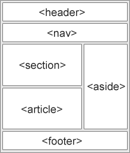

# 面试
## 盒子模型
所有HTML元素可以看作盒子，在CSS中，"box model"这一术语是用来设计和布局时使用。
CSS盒模型本质上是一个盒子，封装周围的HTML元素，它包括：边距，边框，填充，和实际内容

## 浏览器访问页面流程
DNS解析URL对应的IP。
根据IP建立TCP连接（三次握手）。
HTTP发起请求。
服务器处理请求，浏览器接收HTTP响应。
渲染页面，构建DOM树。
关闭TCP连接（四次挥手）。

## vue的生命周期
从开始创建、初始化数据、编译模板、挂在DOM、渲染-更新-渲染、卸载等一系列过程

## AJAX
最大的优点是在不重新加载整个页面的情况下，可以与服务器交换数据并更新部分网页内容。
### POST和GET的区别
1. **GET在浏览器回退时是无害的，而POST会再次提交请求。**

2. GET产生的URL地址可以被Bookmark，而POST不可以。

3. GET请求会被浏览器主动cache，而POST不会，除非手动设置。

4. GET请求只能进行url编码，而POST支持多种编码方式。

5. **GET请求参数会被完整保留在浏览器历史记录里，而POST中的参数不会被保留。**

6. GET请求在URL中传送的参数是有长度限制的，而POST没有。

7. 对参数的数据类型，GET只接受ASCII字符，而POST没有限制。

8. **GET比POST更不安全，因为参数直接暴露在URL上，所以不能用来传递敏感信息。**

9. **GET参数通过URL传递，POST放在Request body中。**

## H5新增
### H5常用的新元素
|  |  |
|  :----  | :----  |
| `<article>` | 定义页面独立内容 |
| `<aside>` | 定义页面的侧边栏内容 |
| `<header>` | 定义文档的头部区域 |
| `<command>` | 定义命令按钮，比如单选框、复选框或者按钮 |
| `<dialog>` | 定义对话框 |
| `<figure>` | 规定独立的流内容（如表格、图片、代码） |
| `<footer>` | 页脚 |
| `<nav>` | 定义导航链接的部分 |
| `<section>` | 文档中的区段 |
### 新增特性
1. `<canvas>`：元素用于图形绘制，需要通过设置脚本完成
2. HTML5 拖放：
`<imgdraggable="true">` ：设置元素为可拖放
拖动什么 - ondragstart 和 setData()
放到何处 - ondragover
进行放置 - ondrop
3. Audio（音频）、Video（视频）
4. 新增表单输入类型和属性
5. H5 语义元素：

## CSS3新特性

## npm yarn cnpm
**npm：** 包管理工具
**yarn：**
1. 确定性安装，可以避免很多潜在的问题，相对安全；
2. 运行速度得到了显著的提升；
3. 无需互联网连接就能安装本地缓存的依赖项，离线模式
**cnpm：** 淘宝团队开发的一个完整的npmjs.org镜像

## hash和history的区别
前端路由实现的功能：1.记录当前页面的状态；2.可以使用浏览器的前进后退功能
**hash**
hash也称作锚点，本身是用来做页面定位的
hash的而传参是基于url的，有体积限制
**history**
可以把数据存放在对象中
url必须和实际后端发起请求的url一致